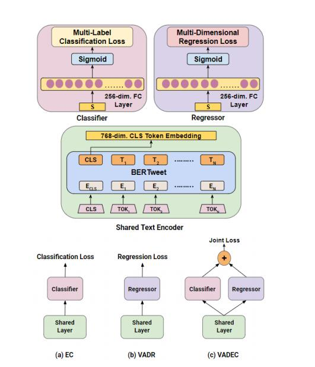

# 文献综述文献收集

## 一、参考写法

[如何写文献综述](https://codeantenna.com/a/0l6GVYCcK2)

https://zhuanlan.zhihu.com/p/48612853

BERT（**B**idirectional **E**ncoder **R**epresentations from **T**ransformers）近期提出之后，**作为一个Word2Vec的替代者**，其在NLP领域的11个方向大幅刷新了精度，可以说是近年来自残差网络最优突破性的一项技术了。论文的主要特点以下几点：

1. 使用了Transformer [2]作为算法的主要框架，Transformer能更彻底的捕捉语句中的双向关系；
2. 使用了Mask Language Model(MLM) [3] 和 Next Sentence Prediction(NSP) 的多任务训练目标；
3. 使用更强大的机器训练更大规模的数据，使BERT的结果达到了全新的高度，并且Google开源了BERT模型，用户可以直接使用BERT作为Word2Vec的转换矩阵并高效的将其应用到自己的任务中。

BERT的本质上是通过在海量的语料的基础上运行自监督学习方法为单词学习一个好的特征表示，所谓自监督学习是指在没有人工标注的数据上运行的监督学习。在以后特定的NLP任务中，我们可以直接使用BERT的特征表示作为该任务的词嵌入特征。所以BERT提供的是一个供其它任务迁移学习的模型，该模型可以根据任务微调或者固定之后作为特征提取器。BERT的源码和模型10月31号已经在Github上[开源](https://link.zhihu.com/?target=https%3A//github.com/google-research/bert)，简体中文和多语言模型也于11月3号开源。

BERT的网络架构使用的是《Attention is all you need》中提出的多层Transformer结构，其最大的特点是抛弃了传统的RNN和CNN，通过Attention机制将任意位置的两个单词的距离转换成1，有效的解决了NLP中棘手的长期依赖问题。Transformer的结构在NLP领域中已经得到了广泛应用，并且作者已经发布在TensorFlow的[tensor2tensor](https://link.zhihu.com/?target=https%3A//github.com/tensorflow/tensor2tensor)库中。

Transformer的网络架构如图1所示，Transformer是一个encoder-decoder的结构，由若干个编码器和解码器堆叠形成。图1的左侧部分为编码器，由Multi-Head Attention和一个全连接组成，用于将输入语料转化成特征向量。右侧部分是解码器，其输入为编码器的输出以及已经预测的结果，由Masked Multi-Head Attention, Multi-Head Attention以及一个全连接组成，用于输出最后结果的条件概率。关于Transformer的详细解析参考我之前总结的[文档](https://zhuanlan.zhihu.com/p/48508221)。

https://zhuanlan.zhihu.com/p/248017234

==在基于深度神经网络的NLP方法中，文本中的字/词通常都用一维向量来表示（一般称之为“词向量”）；在此基础上，神经网络会将文本中各个字或词的一维词向量作为输入，经过一系列复杂的转换后，输出一个一维词向量作为文本的语义表示。特别地，我们通常希望语义相近的字/词在特征向量空间上的距离也比较接近，如此一来，由字/词向量转换而来的文本向量也能够包含更为准确的语义信息。因此，BERT模型的主要输入是文本中各个字/词的原始词向量，该向量既可以随机初始化，也可以利用Word2Vector等算法进行预训练以作为初始值；输出是文本中各个字/词融合了全文语义信息后的向量表示，如下图所示（为方便描述且与BERT模型的当前中文版本保持一致，本文统一以**字向量**作为输入）：==

从上图中可以看出，BERT模型通过查询字向量表将文本中的每个字转换为一维向量，作为模型输入；模型输出则是输入各字对应的融合全文语义信息后的向量表示。此外，模型输入除了字向量，还包含另外两个部分：

\1. 文本向量：该向量的取值在模型训练过程中自动学习，用于刻画文本的全局语义信息，并与单字/词的语义信息相融合

\2. 位置向量：由于出现在文本不同位置的字/词所携带的语义信息存在差异（比如：“我爱你”和“你爱我”），因此，BERT模型对不同位置的字/词分别附加一个不同的向量以作区分

https://www.cnblogs.com/gczr/p/11785930.html

总述：输入嵌入分别是token embeddings, segmentation embeddings 和position embeddings 的总和

BERT最主要的组成部分便是，词向量（token embeddings）、段向量(segment embeddings)、位置向量(position embeddings)

词向量：是模型中关于词最主要的信息
段向量：是因为BERT里面的下一句的预测任务，所以会有两句拼接起来，上句与下句，上句有上句段向量，下句则有下句段向量，也就是图中A与B。此外，句子末尾都有加[SEP]结尾符，两句拼接开头有[CLS]符
位置向量：是因为 Transformer 模型不能记住时序，所以人为加入表示位置的向量
之后这三个向量拼接起来的输入会喂入BERT模型，输出各个位置的表示向量
————————————————
版权声明：本文为CSDN博主「小杨算法屋」的原创文章，遵循CC 4.0 BY-SA版权协议，转载请附上原文出处链接及本声明。
原文链接：https://blog.csdn.net/yangfengling1023/article/details/91954116

## 二、参考文献

### 2.1《2018/2/3 Joint Binary Neural Network for Multi-label Learning with Applications to Emotion Classifification》

arXiv

He H, Xia R. Joint binary neural network for multi-label learning with applications to emotion classification[C]//Natural Language Processing and Chinese Computing: 7th CCF International Conference, NLPCC 2018, Hohhot, China, August 26–30, 2018, Proceedings, Part I 7. Springer International Publishing, 2018: 250-259.

> 近年来，深度学习技术凭借其自动表示学习能力和端到端的学习框架在多标签分类中取得了成功。**现有的用于多标签分类的深度神经网络可分为两类:二元相关神经网络(BRNN)和阈值依赖神经网络(TDNN)。**然而，前者需要训练一组孤立的二值网络，忽略了标签之间的依赖关系，计算量大;而后者需要额外的阈值函数机制将多类别概率转换为多标签输出。本文提出一种联合二值神经网络(JBNN)，以解决这些缺点。在JBNN中，文本表示被送入一组logistic函数而不是softmax函数，多个二分类在一个神经网络框架中同步进行。此外，通过在联合二进制交叉熵(JBCE)损失上进行训练来捕获标签之间的关系。为了更好地满足多标签情感分类，进一步提出将先验标签关系融入JBCE损失中。在基准数据集上的实验结果表明，该模型在分类性能和计算效率上均明显优于当前主流的多标签情感分类方法。

传统的多标签情感分类方法通常采用两步策略，首先需要开发一套手工制作的专家特征(如词袋、语言特征、**情感词典**等)，然后利用多标签学习算法[Xu et al.， 2012;Li等人，2015;Wang和Pal, 2015;Zhou等，2016;Yan和Turtle, 2016]用于多标签分类。然而，特征工程是一项劳动密集型和耗时的工作，并且系统性能高度依赖于人工设计的特征集的质量。**近年来，深度神经网络因其能够自动学习原始数据的内部表示，并将特征表示学习和分类集成到一个端到端的框架中而受到越来越多的关注。**

现有的多标签分类深度学习方法大致可以分为两类:

•二值相关神经网络(Binary relevance neural network, BRNN)，它为每个标签构建一个独立的二值神经网络，其中多标签分类被认为是一组独立的二值分类任务，标签集的预测由单个标签的独立预测组成。

•阈值依赖神经网络(TDNN)，通常构建一个神经网络，通过softmax函数生成所有标签的概率，其中概率之和为1。然后，进一步需要一个额外的阈值机制(如校准的标签排序算法)来将多类别概率转换为多标签输出。

这两种方法都有其不足之处。前者BRNN，在文献中通常称为二进制相关性(BR)转换[Spyromitros et al.， 2008]，它不仅忽略了标签之间的依赖关系，而且由于需要训练一个唯一的分类器并对每个标签进行预测，因此消耗更多的资源。后者TDNN虽然只有一个神经网络，但只能生成所有类别标签的类别概率。相反，它需要一个额外的阈值函数机制来将类别概率转换为多标签输出。然而，构建有效的阈值函数也是多标签学习的一大挑战

**本文提出一种简单的联合二值神经网络(JBNN)来解决这两个问题。我们在图1 (c)中展示了JBNN的结构。可以看到，在JBNN中，网络的底层与TNDD中相似。具体来说，我们采用双向长短期记忆(Bidirectional Long Short-Term Memory, Bi-LSTM)结构来建模句子。同时构建了注意力机制，得到句子表示。之后，我们将句子的表示提供给多个逻辑函数，以产生一组二元概率，而不是TDNN中使用的softmax函数。也就是说，对于每个输入句子，我们在一个神经网络框架中同时进行多个二分类。与BRNN不同的是，该网络中的多个分类组件共享词向量、LSTMs和句子表示。此外，基于联合二进制学习损失捕获标签之间的关系。最后，将多变量伯努利分布转换为多标签输出，与BRNN相同。JBNN模型基于联合二进制交叉熵(JBCE)损失进行训练。为了更好地满足多标签情感分类任务，进一步提出将先验标签关系融入JBCE损失中。在广泛使用的多标签情感分类数据集Ren- cecps上对JBNN模型进行了评估[Quan and Ren, 2010]。我们将该模型与传统方法和神经网络进行了比较。实验结果表明:**

•我们的JBNN模型比近年来提出的最先进的传统多标签情感分类方法表现得更好;

•与BRNN和TDNN系统相比，我们的

JBNN模型在分类性能和计算效率上也表现出了优先级。

**该文也详细的介绍了多标签分类任务和多标情感分类任务的发展**

首先简要回顾了传统的多标记学习工作，然后重点介绍了基于神经网络的方法。传统的多标签分类方法主要分为两类:问题转换方法和算法自适应方法[Zhang and Zhou, 2014]。问题转换方法是处理多标签分类问题最直接的方法。他们将多标签分类问题转化为单标签问题，如几个二元问题[Spyromitros等人，2008;Read等人，2009;孙和工藤，2015;Zhang等，2015;Zhou等人，2017]，多类问题[Read, 2008;Tsoumakas和Vlahavas, 2007]或标签排序问题[¨ullermeier等人，2008;F¨urnkranz等，2008]。算法自适应方法扩展了现有的单标签分类算法以处理多标签分类[Cheng和H¨ullermeier, 2009;张和张，2010;黄等人，2012;张，周，2014。近年来，神经网络(NN)方法受到越来越多的关注。在多标记学习领域，近年来出现了许多神经网络方法。正如我们提到的，神经网络可以用两种不同的方式来构建多标签分类，即BRNN和TDNN。Feng等人[2017]通过将原始多标签数据集转换为单标签数据集，采用BRNN结构来训练多个独立的二进制卷积网络(cnn)。大部分作品属于后者。Zhang等人[2006]提出了一种BP-MLL模型，该模型自3层前向神经网络改进而来，通过要求属于某个实例的标签的排名应该高于不属于该实例的标签，从而考虑到标签之间的依赖关系。最后，通过阈值决策得到多标签输出。Nam等人[2014]用二元交叉熵代替BP-MLL的两两排序损失，并使用文档的TF-IDF表示作为网络输入。Read等人[2014]使用受限玻尔兹曼机来开发更好的特征表示。Kurata等人[2016]在基于卷积网络的多标签学习中利用了标签的共现。Lenc等人[2017]使用标准的前馈网络和带有阈值的流行卷积网络(cnn)来获得最终的分类结果。然而，这些基于神经网络的多标签分类算法大多需要一个额外的阈值机制来生成多标签输出。

现在，我们重点回顾针对多标签分类的方法。Xu等人[2012]提出了一种由粗到细的多标签情感分类策略。为了解决数据稀疏性问题，他们通过引入相邻句子的转移概率来细化情感类别。Li et al.[2015]将多标签情感分类重定义为因子图推断问题，其中标签依赖和上下文依赖被建模为各种因子函数。Yan等人[2016]为每个情绪类别建立了一个单独的二元分类器，以检测在使用传统unigram特征的推文中是否存在某个情绪类别。深度学习技术也被用于情感分类。Zhou等人[2016]提出了一种情绪分布学习(emotion distribution learning, EDL)方法，该方法首先使用递归自编码器(recursive auto-encoders, RAEs)提取特征，然后将标签关系融入到代价函数中进行多标签情绪分类。不同于将文本表示和多标签分类分离的EDL模型，JBNN模型将表示学习和多标签分类集成在一个神经网络中，提供了一个端到端的学习框架。Wang等[2016]采用TDNN框架，首先构建卷积神经网络(CNN)进行多类分类，然后使用校准标签排序(CLR)算法得到多标签输出。由于CLR算法依赖于每个标签的二分类得分，因此也采用BRNN框架，为每个标签构建二分类CNN分类器。JBNN是一种联合的单步学习方法，既不需要像TDNN那样额外的有效阈值函数，也不需要像BRNN那样训练一组独立的二分类器。

### 2.2 《2018/4/17 AttnConvnet at SemEval-2018 Task 1: Attention-based Convolutional Neural Networks for Multi-label Emotion Classifification》

arXiv

Kim Y, Lee H, Jung K. Attnconvnet at semeval-2018 task 1: Attention-based convolutional neural networks for multi-label emotion classification[J]. arXiv preprint arXiv:1804.00831, 2018.

> 该文提出了一种基于注意力的分类器，可以对给定句子的多种情感进行预测。该模型模拟了人类理解句子的两步过程，能够有效地表示和分类句子。通过表情符号到意思的预处理和额外的词典利用，进一步提高了模型的性能。使用SemEval-2018任务1-5提供的数据训练和评估模型，其中每个句子都有11种给定情感中的几个标签。我们的模型在英语和西班牙语中分别取得了第五和第一名。

注意力机制是深度学习中最受关注的趋势之一，最近也进入了NLP。应用于具有神经网络的系统，它的功能就像人类的视觉注意机制(Denil et al.， 2012)，随着时间的推移，最有效的特征区域将被突出显示，使系统更好地利用

受(Vaswani et al.， 2017)的启发，我们提出了一种基于注意力的多标签句子分类器，可以有效地表示和分类句子。该系统由一个自注意力模块和多个cnn组成，使其能够模仿人类分析句子的两步过程:理解和分类。此外，表情符号到含义的预处理和额外词汇的利用提高了模型在给定数据集上的性能。我们在(Mohammad等人，2018)的数据集上评估了我们的系统，它在英语和西班牙语中分别排名第五和第一。

然后，人类分别将句子分类到每种情感，**而不是一次性全部分类，这就是我们的系统使用11个独立cnn的原因。**除了主体结构之外，由于预处理在NLP任务中占很大比例，特别是当

我们的系统主要处理数量有限的推文数据，这些数据噪声很大。在这种情况下，数据预处理对模型性能有至关重要的影响。表情符号可能是推文的一个典型属性，我们发现相当多的推文包含表情符号。**每个表情符号都有自己的含义，我们将数据中的每个表情符号转换为代表其含义的短语/单词。**我们将这个过程称为表情符号到含义（emoji-to-meaning）的预处理。有些推文过多地重复某些表情符号，可能会使句子过于偏向某些情绪。出乎意料的是，移除重叠的表情降低了性能。

嵌入:在处理小型数据集时，使用预训练的词嵌入特别有用。在那些众所周知的词嵌入中，如Word2Vec(Mikolov等人，2013)，GloVe(Pennington et al.， 2014)和fastText(Piotr et al.， 2016)，我们对英语采用300维GloVe向量，它是在8400亿个令牌的Common Crawl数据上训练的，对西班牙语采用300维fastText向量，它是在维基百科上训练的。

自注意力:**Vaswani et al.(2017)提出了一种基于点积注意力模块的非循环机器翻译架构Transformer**。通常，注意力机制被用作深度学习模型的子模块，在给定序列的情况下计算每个位置的重要性权重。在该系统中，我们采用了(Vaswani et al.， 2017)中的自注意力机制来表示句子。self-attention的详细结构如图2所示。每个嵌入向量与权重矩阵W∈R de×3de的点积通过维度划分为相同大小的Q、K、V，其中de为嵌入向量的维度。然后，出席向量的计算如(3)所示。

并使用每个类的交叉熵之和作为最终的损失函数。

表1显示了同一模型在不同预处理下的准确率。我们发现，表情符号到含义的预处理可以将模型的准确率提高1%。当一个表情符号被转换成它的意思时，它可以被表示为情感词汇的组合，不仅可以减少冗余词汇，还可以进一步强调某些情绪的影响。

该文提出了一种基于注意力机制的句子分类器，可以将一个句子分类为多种情感。实验结果表明，该系统具有有效的句子理解结构。**我们的系统大致遵循人类对句子进行多标签分类的过程。然而，有些情绪可能有一定的相关性，而我们的模型则独立地对待它们。在未来的工作中，我们希望进一步考虑情感之间的潜在联系。**

### 2.3《2018/4/18 NTUA-SLP at SemEval-2018 Task 1: Predicting Affective Content in Tweets with Deep Attentive RNNs and Transfer Learning》

arXiv

Baziotis C, Athanasiou N, Chronopoulou A, et al. Ntua-slp at semeval-2018 task 1: Predicting affective content in tweets with deep attentive rnns and transfer learning[J]. arXiv preprint arXiv:1804.06658, 2018.

> 本文介绍了提交SemEval-2018 Task 1竞赛的深度学习模型:" Affect In Tweets "。我们参与了英语推文的所有子任务。**本文提出一种配备多层自注意力机制的Bi-LSTM架构。**注意力机制提高了模型的性能，允许我们识别推文中的重要单词，以及对模型的深入了解，使它们更具有可解释性。**该模型利用了一组word2vec词嵌入，在5.5亿条Twitter消息的大型集合上进行了训练，并通过一组单词情感特征进行了增强。**由于特定任务的训练数据量有限，我们**选择了一种迁移学习方法，即在Semeval 2017任务4A的数据集上对bi - lstm进行预训练。**所提方法在子任务E“多标签情绪分类”中排名第一，在子任务A“情绪强度回归”中排名第二，并在其他子任务中取得了较好的结果。

**这一段简介比其他文章写的好**

社交媒体内容已经主导了在线交流，用新的句法和语义结构丰富和改变了语言，允许用户在简短的文本中表达事实、观点和情感。由于数据的广泛可用性和有趣的语言新奇性，这些内容的分析在自然语言处理研究中受到了极大的关注。特别是对Twitter中情感内容的研究已经产生了各种各样的新颖应用，例如跟踪产品感知(Chamlertwat et al.， 2012)，关于政治倾向的民意检测(PlaHurtado, 2014;Tumasjan等人，2010)，股票市场监测(Si等人，2013;Bollen等人，2011b)等。表情符号和缩略语、标签、俚语等特殊语言形式的广泛使用与传统语言结构不一致，使得Twitter的自然语言处理更具挑战性。

本文介绍了一个在SemEval 2018任务1:"影响推文"中脱颖而出的深度学习系统。本文探索了**一种迁移学习方法来补偿有限的训练数据，该方法使用Semeval任务4A的情感分析数据集(Rosenthal等人，2017b)来预训练模型，然后在每个子任务的数据上进一步微调它。我们的模型在单词级别上运行，使用了配备了深度自注意力机制的双向LSTM (Pavlopoulos等人，2017)。此外，为了帮助解释模型的内部工作，提供了推文的可视化，并标注了注意力层预测的显著标记。**

(1)词嵌入预训练，在我们未标记的Twitter数据集上训练word2vec和情感词嵌入，(2)迁移学习步骤，在情感分析任务上预训练深度学习模型，(3)微调步骤，在每个子任务上微调预训练模型。

2.2词嵌入

词嵌入是词的密集向量表示(Collobert和Weston, 2008;Mikolov等人，2013)，捕捉它们的语义和句法信息。为此，训练了word2vec词嵌入，并在其中添加了10个情感维度。**我们使用预训练的嵌入来初始化神经网络的第一层(嵌入层)。**Word2vec嵌入。我们利用未标记的数据集来训练特定于twitter的词嵌入。我们使用word2vec (Mikolov等人，2013)算法，采用skip-gram模型，负采样为5，最小单词数为20。利用Gensim的(ˇReh˚uˇrek and Sojka, 2010)实施。由此产生的词汇表包含80万个单词。

（affective embeddings）情感嵌入。从人工标注的小词典开始，使用语义相似度和一个线性模型沿着十个与情感相关的维度估计新词的连续规范(在[- 1,1]区间内)，即:效度、支配性、觉醒、愉悦、愤怒、悲伤、恐惧、厌恶、具象化、熟悉度。生成单词级别规范的方法在(Malandrakis et al.， 2013)中有详细介绍，它基于这样的假设:给定两个单词之间的相似性度量，人们可以推导出它们的情感评分之间的相似性。该方法使用一组已知情感评级的N个单词(种子词)作为起点。具体来说，我们计算单词w的情感评分如下:

这张图可以我画的时候画成多层次的来参考

尽管模型迁移在计算机视觉中取得了广泛的成功，**但在NLP中，预训练词向量以外的迁移学习并不普遍。**

**在我们的系统中，我们探索了在Twitter的情感分析任务中预训练网络的方法，并使用它来初始化每个子任务的模型权重。**我们选择了Semeval 2017 Task4A (SA2017)的数据集(Rosenthal等人，2017b)，这是一个与该任务的情感数据集在语义上相似的数据集。**通过在相似领域的数据集上进行预训练，源数据集和目标数据集更有可能具有相似的分布。**

**为了构建我们的预训练模型，我们使用word2vec Twitter嵌入初始化嵌入层的权重，并在SA2017上训练一个具有深度自注意力机制的双向LSTM (BiLSTM) (Pavlopoulos等人，2017)，类似于(Baziotis等人，2017)。然后，我们利用网络的编码部分，即BiLSTM和attention层，去掉最后一层。该预训练模型用于所有子任务，并添加特定于子任务的最后一层，用于分类/回归。**

有RNN的描述

2.5循环神经网络

我们使用循环神经网络(RNN)对Twitter消息进行建模。rnn按顺序处理它们的输入，对序列中的每个元素执行相同的操作，ht = fW (xt, ht−1)，其中ht是隐藏状态，t是时间步长，W是网络权重。我们可以看到，每个时间步长的隐藏状态取决于之前的隐藏状态，因此元素(单词)的顺序很重要。这个过程也使rnn能够处理可变长度的输入。rnn很难训练(Pascanu等人。2013)，因为梯度可能在长序列上呈指数级增长或衰减(Bengio等人，1994;Hochreiter et al.， 2001)。克服这些问题的一种方法是使用更复杂的常规rnn变体，如长短期记忆(LSTM)网络(Hochreiter和Schmidhuber, 1997)或门控循环单元(GRU) (Cho等人，2014)，引入一种门控机制以确保通过网络的适当梯度流。

2.6自注意力机制

rnn在处理序列时更新其隐藏状态hi，最终的隐藏状态保存了序列中信息的摘要。为了放大重要单词在最终表示中的贡献，使用了自注意力机制(Bahdanau et al.， 2014)，如图3所示。通过采用注意力机制，输入序列r的表示不再局限于最终状态hN，而是所有隐藏状态hi的组合。这是通过计算序列表示来完成的，即所有hi的凸组合。权重ai由网络学习，它们的大小表示每个hi在最终表示中的重要性。正式:

**之后，我们将预训练模型的最后一层替换为特定于任务的层，并针对每个子任务对整个网络进行微调。**

他们的嵌入层就是他们预先弄的word2vec的升级版

我们的迁移学习模型是基于(Baziotis等人，2017)中的情感分析模型。它由一个具有深度自注意力机制的2层双向LSTM (BiLSTM)组成。

**嵌入层：**网络的输入是一条Twitter消息，被视为单词序列。我们使用一个嵌入层来投影单词w1, w2，…， wN为一个低维向量空间RW，其中W是嵌入层的大小，N是推文中的单词数。我们使用预训练的词嵌入初始化嵌入层的权重(2.2节)。

**BiLSTM层：**LSTM将单词嵌入序列作为输入，并生成单词注释h1, h2，…， hN，其中hi是LSTM在时间步长i的隐藏状态，总结了句子直到wi的所有信息。我们使用双向lstm (BiLSTM)来获取从两个方向总结信息的单词注释。一个BiLSTM由2个LSTM组成，一个正向LSTM−→f(将句子从w1解析为wN)和一个反向LSTM←−f(将句子从wN解析为w1)。我们通过连接两个方向的注释来获得每个单词hi的最终注释，

输出层。我们使用向量r作为特征表示，我们将其提供给最终的特定于任务的层。对于回归任务，我们使用一个具有一个神经元和一个sigmoid激活函数的完全连接层。对于有序分类任务，我们使用一个全连接层，然后使用sof tmax操作，输出类的概率分布。最后，对于多标签分类任务，我们使用一个具有11个神经元(标签数量)和一个sigmoid激活函数的全连接层，**对每个标签执行二进制分类。**

3.2微调

在预训练数据集上训练网络后(SA2017)，我们对每个子任务进行微调，通过重新将其最后一层与特定于任务的层替代。**我们实验了两种微调方案。第一种方法是对整个网络进行微调，即对预训练编码器(BiLSTM)和特定任务层进行微调。第二种方法是仅将预训练模型用于权重初始化，在训练期间冻结其权重，并只微调最后一层。实验结果表明，第一种方法在所有任务上都取得了明显更好的结果。**

3.3正则化

在两个模型中，我们在嵌入层中添加了高斯噪声，这可以解释为一种随机数据增强技术，使模型对过拟合更具鲁棒性。此外，我们使用dropout (Srivastava等人，2014)，并在验证损失停止下降后停止训练(早期停止)。此外，我们没有微调嵌入层。出现在训练集中的单词被投影到嵌入空间中，分类器将嵌入空间的某些区域与某些情感关联起来。然而，仅包含在测试集中的词仍然停留在其初始位置，可能不再反映其“真实”情感，从而导致错误分类。

### 2.4 《2018/12/4 Practical Text Classifification With Large Pre-Trained Language Models》

arXiv

Kant N, Puri R, Yakovenko N, et al. Practical text classification with large pre-trained language models[J]. arXiv preprint arXiv:1812.01207, 2018.

> 多情感情感分类是一个自然语言处理(NLP)问题，在真实世界的数据上有价值的用例。**大规模无监督语言建模结合微调，在困难的数据集上为这项任务提供了一个实用的解决方案，包括那些具有标签类不平衡和特定领域上下文的数据集。通过在40GB的文本(亚马逊评论)上训练基于注意力的Transformer网络(Vaswani et al. 2017) (McAuley et al. 2015)并对训练集进行微调，我们的模型在SemEval任务1:E-c多维情感分类问题(Mohammad et al. 2018)上取得了0.69 F1分数，该分数基于普鲁契克情感轮(Plutchik 1979)。**这些结果与最先进的模型相竞争，包括在困难(情绪)类别上的F1分数很高，如恐惧(0.73)、厌恶(0.77)和愤怒(0.78)，以及在罕见类别上的竞争结果，如预期(0.42)和惊讶(0.37)。展示了在真实世界的文本分类任务上的应用。创建了一个关于几个主题的真实推文的小范围收集的文本数据集，并表明经过微调的模型在该数据集上的情感和多维情感分类的通用商用api有很大的优势。还进行了各种额外的研究，调查了用于实现实用多维情感分类的深度学习架构、数据集和算法的属性。总的来说，无监督语言建模和微调是一个简单的框架，可以在真实世界的情感分类上取得高质量的结果。

**该文章比较偏商业应用以及微调效果的证明**

可以学放这样的图

最近的工作表明，语言模型——无论是RNN变体，如乘性LSTM (mLSTM) (Krause等人2016年)，还是基于注意力的Transformer网络(Vaswani等人2017年)——都可以在非常大的数据集上有效地训练，得到的模型可以迁移到下游的语言理解问题，通常在学术数据集上匹配或超过以前的最先进方法。然而，这些模型在实际文本分类问题上的表现如何，使用真实世界的数据?

**在一个大型40GB文本数据集上训练mLSTM和Transformer语言模型(McAuley et al. 2015)，然后将这些模型迁移到两个文本分类问题:二元情感(包括中性标签)和基于普鲁契克情绪轮的多维情感分类(普鲁契克1979)。研究了在这些任务上的表现，包括在大型学术数据集上，以及从有关几个特定主题的社交媒体消息(如视频游戏)编译的原始文本数据集上。实验表明，该方法在没有特定领域训练和过度超参数调优的情况下，在学术数据集上符合最先进的水平。**与此同时，在社交媒体数据集上，所提出方法的表现明显优于商业上可用的api，即使这些模型被重新校准到测试集。**1) Transformer模型的性能通常优于mLSTM模型，特别是在多维情感分类上进行微调时;2)模型的微调显著提高了mLSTM和Transformer模型在情感任务上的性能。该方法创建了对日益困难的文本分类问题具有良好泛化能力的模型，并提供了消融研究来证明这种效果。**由于领域之间的未知单词、专业上下文、口语化语言和其他差异，很难用单一模型进行跨领域的文本分类。例如，像war和sick这样的单词在电子游戏的语境中并不一定是负面的，这在我们的数据集中表现得很明显。通过在大型文本数据集上训练语言模型，将模型暴露在许多上下文中。**也许少量的下游迁移就足以在适当的环境下为情感分类选择正确的上下文特征。无监督语言建模与微调相结合，为专门的文本分类问题提供了一种实用的解决方案，包括那些具有大类别类别不平衡和人类标签显著分歧的问题。**

### 2.5《2019/3/17 A Deep Learning-Based Approach for Multi-Label Emotion Classifification in Tweets》

applied sciences

Jabreel M, Moreno A. A deep learning-based approach for multi-label emotion classification in tweets[J]. Applied Sciences, 2019, 9(6): 1123.

> 目前，人们使用Twitter或Facebook等在线社交媒体来分享他们的情绪和想法。检测和分析社交媒体内容中表达的情感，在商业、公共卫生、社会福利等领域具有重要的应用价值。以往的情感和情绪分析工作大多只关注于单标签分类，忽略了同一实例中存在多个情感标签的情况。该文介绍了一种新颖的基于深度学习的系统，用于解决Twitter中的多情感分类问题。本文提出一种新的方法将其转换为二分类问题，并利用深度学习方法来解决转换后的问题。该系统的表现超过了最先进的系统，在具有挑战性的SemEval2018任务1:e- c多标签情感分类问题上取得了0.59的准确率分数。

有详细介绍**问题转化**的部分，相当于解决多标签分类的办法。该文对BR的方法介绍的很详细还有相应的参考文献，可以拿过来

• 我们针对多标签分类问题，提出了一种新的转换机制。

• 我们提出一种新的基于注意力机制的深度学习系统，称为二值神经网络(BNet)，基于新的转换方法工作。该系统是一个数据驱动的、基于神经的端到端模型，不依赖于词性标记器和情感或情感词典等外部资源。

• 在 SemEval-2018 Task1: Affect in Tweets 的具有挑战性的多标签情绪分类数据集上评估了所提出的系统。

• 实验结果表明，该系统的性能优于目前最先进的系统。

### 2.6 《2019/11/8 Seq2Emo for Multi-label Emotion Classifification Based on Latent Variable Chains Transformation》

arXiv

Huang C, Trabelsi A, Qin X, et al. Seq2emo for multi-label emotion classification based on latent variable chains transformation[J]. arXiv preprint arXiv:1911.02147, 2019.

> 文本情感检测是自然语言处理中的一项重要任务，在许多应用中至关重要。现有方法大多将该任务视为单标签多类文本分类问题。以预测多种情感为例，现有的大多数工作都将其视为一个通用的多标签分类(MLC)问题，它们通常要么在神经网络模型的最后一个输出层应用人工确定的阈值，要么训练多个二分类器并以一对多的方式进行预测。然而，与一般MLC数据集中的标签相比，情感类别的数量要少得多(小于10)。**此外，情绪之间往往有更多的相关性。例如，人类通常不会同时表达“喜”和“怒”，但很有可能同时表达“喜”和“爱”。鉴于这种直觉，本文提出了一种隐变量链(LVC)变换和一个量身定制的模型——Seq2Emo模型，不仅自然地预测多个情感标签，而且考虑了它们的相关性。**在现有的多标签情感数据集和新收集的数据集上进行了实验。实验结果表明，该模型优于现有的先进方法。

从文本中挖掘情感(Sailunaz et al. 2018;Yadollahi, Shahraki, and Za¨ıane 2017)在最近的自然语言处理(NLP)研究中引起了越来越多的关注。然而，现有工作大多将该任务视为一般的多类文本分类问题。多类文本分类问题将单个标签集合中的单个标签l与任意实例X关联起来。然而，在许多其他情况下，实例X可能具有多个标签。例如，人类情感的检测就是这样一个场景。由于人类情感的复杂性，一个文本实例很可能表达多种情感。这些情绪也可能是相互关联的。例如，“憎恨”和“厌恶”等情绪一起出现的次数可能比单独出现的次数更多。通常情况下，可能表达的情绪的数量不大。因此，本文将从文本中挖掘情感视为多标签分类(MLC)问题的一个特殊情况，其中标签(情感)的数量较少，并且它们之间可能存在相关性。

MLC问题的常见方法通常涉及各种**问题转换方法**，其中一个MLC问题可以转换为多个单标签文本分类问题。因此，一般的单标签分类器可以直接采用，也可以稍加修改。著名的转换技术包括**二进制相关性(BR) (Godbole和Sarawagi 2004)、分类器链(CC) (Read等人2011)和标签Powerset (LP) (Tsoumakas、Katakis和Vlahavas 2010)。**给定L = {l1, l2，···，lk}一组标签，BR和CC的转换都需要训练k个二分类器，其中每个分类器负责区分单个标签li。**与BR相比，CC考虑了标签之间的相关性，而BR则独立预测每个标签。**LP将每个可能的标签组合视为一个单独的标签，因此它可能会将标签数量扩大到2k，当k很大时通常是不可用的。鉴于神经网络(NN)研究的最新进展，在许多NLP任务中取得了巨大成功(Peters et al. 2018;Devlin et al. 2019)，**本文提出一种新的问题转换，仅使用NN模型的潜变量作为"链"来执行MLC任务。作为对CC的类比，我们将这种转换称为潜变量链(LVC)。在LVC方法的基础上，还定制了一个深度神经网络模型Seq2Emo，该模型首先捕获实例X的语义和情感特征，然后使用双向LVC生成标签。该模型根据潜在特征链进行一系列预测，从而实现多标签情感分类。**此外，从零开始收集了一个包含平衡多标签情感推文(BMET)的数据集，以测试基线模型和所提出的方法。

主要贡献如下:(1)提出了一种面向神经网络模型的MLC问题转换方法LVC，并考虑了目标标签之间的相关性，这对于多标签情感分类等任务具有一定的相关性。（2）此外，本文提出Seq2Emo，一种基于LVC的新型神经网络模型，利用深度学习的许多最新研究进展，在文本情感分类方面取得了令人鼓舞的结果。(3)为了验证所提方法的有效性，构建了一个新的大型平衡多标签情感数据集BMET。

MLC的主要方法之一是基于转换的方法。它将MLC任务转换为一些一对多的单一标记问题(Boutell等人2004;Read et al. 2011)。在这种情况下，标签之间的相关性或共现性被简单地忽略了，因为问题被转换为孤立的分类问题。几个用于情感的MLC模型遵循这种方法，将问题转换为二分类问题(Baziotis等人，2018)。**然而，当使用大量标签或数据集时，这些模型的计算成本可能很高。**另一组方法采用阈值依赖方法。这些方法通常在输出概率上设置一个阈值，以确定预测的类别(Chen et al. 2017;Kurata, Xiang, and Zhou 2016)。本文将多标签情感分类问题视为一个定长标签序列生成问题。不同于阈值依赖模型，情感标签按顺序生成，且标签之间相互依赖。最近，用于情感分类的深度学习方法取得了成功。使用深度学习方法可以避免特征工程的劳动密集型任务，而这在其他分类范式中通常是必要的(Yan和Turtle 2016)。深度学习方法也提出了一个端到端的分类框架，但仍然依赖于一个需要学习或实现的阈值函数(Yu et al. 2018)。找到一个好的阈值函数本身就是一个具有挑战性的问题(Fan and Lin 2007)。其他方法，如He和Xia(2018)的工作，虽然没有使用任何基于阈值变换的方法，但他们纳入了一些关于不同情感关系的先验知识，以更好地分类。本文没有使用任何外部或先验知识，也没有使用阈值机制。

3.1 MLC任务

在文本分类任务中，实例X通常采用X = [x1, x2, x3，···，xn]的形式，其中xi是一个单词或词，n是序列的长度。此外，每个X被赋予一个目标Y，其中Y⊆L表示X对应的标签。集合关系“⊆”表示每个Y可以包含L中的多个元素，也可以不包含它们(即Y =∅)。因此，一个MLC模型应该学习P(Y |X)的条件分布，其中Y是一个集合，元素的数量|Y |并不总是等于1。

**3.2 BR变换**

二进制相关变换是一种简单但非常自适应的方法，它允许将任何单标签分类器合并到MLC的任务中。首先，目标Y表示为二进制向量Y b = (y1, y2，···，yk)，其中yi, 1(li∈Y) 2。一般来说，当标签集L的大小为k时，这种类型的转换将需要k个单独的模型。表示BR变换的分类器为Cj B (j∈[1··k])。分类器Cj B只负责yi的生成。换句话说，Cj B正在学习P(yi |X)的概率分布，而Y B是由所有k个分类器的预测生成的。

传统的分类器，如SVM, Na¨ıve Bayes等，可以通过BR变换用于MLC任务。**深度学习模型虽然仍然可以直接使用，但不一定需要k个完全独立的模型。**在将神经网络模型应用于单标签文本分类时，实例X首先由一些类型的神经网络编码器表示，如CNN (Kim 2014)、RNN (Hochreiter和Schmidhuber 1997)、Transformer (Vaswani et al. 2017)等，然后应用一个全连接(FC)层，使用SoftMax归一化器将表示投影到标签空间。FC层本身可以被认为是一个分类器，它将任何编码器生成的X的向量表示作为输入。**因此，k个分类器共享相同的编码器且仅具有不同的FC层是更有效的。**

二元相关(BR)的两种变体转换神经网络模型。左上(绿色)块表示使用两个单元格的二进制分类器，右上(紫色)块表示使用一个单元格和阈值τ的分类器

已知，FC层记为F Cj (j∈[1，···，k])，在BR变换的情况下，每个F Cj负责二分类。如图1所示，可以使用两种主要的二进制FC分类器变体。第一种分类器与另一种分类器一样有两个单元格。两个单元的输出通过SoftMax进行正则化。表示两个细胞b0j和b1j，则yi, 1(b0j &lt;B1 j);另一种方法涉及额外的超参数τ，并且在F Cj层的另一端只有一个细胞。输出通常通过Sigmoid激活函数正则化，使输出将在(0,1)的范围内。相应地，将输出表示为b r j，通过yi, 1(b r j &gt;τ)。在**这个模型中，假设标签是独立的。然而，这种假设通常不成立，特别是当标签与情绪相对应时(Shahraki和Za¨ıane 2017)。**

本文提出一种称为LVC (Latent Variable Chains)的变换方法。LVC利用了循环神经网络(RNN)模型在解码的每一步都具有中间隐藏状态的特殊性质。

LVC使用与BR变换中相同的标签表示Y b，并且它需要一个信号序列S = (s1，···，sk)。该信号的长度与整个标签集L的大小相同，每个信号都是Y b中生成二进制标签的辅助输入。在公式4中，hj是来自RNN解码器的隐藏状态，进一步用于生成yj。与公式3相比，yj−1不需要生成yj。相反，我们使用信号sj作为辅助输入来辅助yj的解码。因此，在训练和推理阶段不会存在暴露偏差问题。另外，隐状态hj仍然保留了前一个解码步骤的信息(通过输入hj−1)，因此可以在生成二进制标签Y b的过程中计算标签之间的相关性。P roj是一个将隐藏状态投影到二进制空间(两个单元格)的模型，以便能够使用SoftMax估计标签yj的可能性。通常选择的P roj层可以是一个或多个密集或全连接层。

### 2.7 《2020/4/3 Latent Emotion Memory for Multi-Label Emotion Classifification》

https://doi.org/10.1609/aaai.v34i05.6271

Fei H, Zhang Y, Ren Y, et al. Latent emotion memory for multi-label emotion classification[C]//Proceedings of the AAAI conference on artificial intelligence. 2020, 34(05): 7692-7699.

> 识别句子中的多种情感是一个重要的研究课题。现有方法通常将该问题建模为多标签分类任务。然而，以往的方法存在两个问题，限制了任务的性能。**首先，这些模型没有考虑句子中情感的先验分布;二是无法有效捕捉与情感密切相关的上下文信息。该文提出了一种用于多标签情感分类的潜在情感记忆网络(LEM)。所提模型可以在不需要外部知识的情况下学习潜在情感分布，并能有效地将其利用到分类网络中。**在两个基准数据集上的实验结果表明，所提模型优于强基线模型，达到了最先进的性能。

**不按照多标签分类的套路来出牌，而学习潜在的情感分布来进行分类。**

情感分类是自然语言处理(NLP)中的一项重要任务。自动推断情感是下游应用的第一步，如情感聊天机器人(Zhou等人2018年)，股票市场预测(Nguyen, Shirai和Velcin 2015年)，政策研究(伯明翰和斯米aton 2011年)等。然而，一篇文本往往包含多种情感。直觉上，人们倾向于在一段文本中表达多种情感。以下面的句子为例:(S1)新的《蝙蝠侠》系列怎么样?看起来不错，但我已经厌倦了这种游戏风格。(S2)在最糟糕的方面，它真的很神奇。听到这番评论后，我忍不住笑了起来。在句子S1中，表达了多种情绪，包括期待、厌恶、爱和悲观。句子S2包含两种情绪:快乐和悲伤。如何识别一个句子中共存的多种情感仍然是一项具有挑战性的任务。已有工作考虑多标签情感分类(He and Xia 2018;Almeida等，2018;Yu et al. 2018)。然而，仍然有两个限制。1)他们假设每种情绪发生的先验概率相等，并且没有考虑句子中先前的情感分布。直观地说，句子中不同的情感有不同的强度。图1展示了句子S1的情绪分布，其中有四种不同强度的情绪。特别是，预期和悲观情绪比厌恶和爱的情绪更强烈。高强度的情感标签在模型的最终预测中应该具有更高的概率。2)以往的工作**没有有效地捕获与情感密切相关的上下文信息，而上下文信息对情感预测至关重要。在句子S2中，表示悲伤情绪的“最差”的线索分散在各处，周围是支持喜悦情绪的“笑”和“惊人”等词。**只有当这些特征能够被充分挖掘和正确选择时，才能做出正确的预测。**如果我们能够充分地捕捉每种情绪的有效特征，最终的预测将相对容易。这就要求模型具有很强的特征提取能力。**

为了解决这些问题，本文提出了一种用于多标签情感分类的**潜在情感记忆网络(LEM)**。LEM主要由两个部分组成:潜在情感模块和记忆模块，如图2所示。首先，潜在情感模块通过变分autoencoder重构输入来学习情感分布来传输。其次，记忆模块为相应的情感捕获与情感相关的特征;最后，将来自记忆模块的特征表示与潜在情感模块的情感分布表示相连接，送入双向门控循环单元(BiGRU)进行预测。所有组件在有监督的端到端学习中联合训练:来自潜在情绪模块的潜在变量表示指导记忆模块的预测，而情绪记忆模块反过来鼓励潜在情绪模块通过反向传播更好地学习情绪分布。**该模型可以在不需要外部知识的情况下学习潜在情感分布信息，并有效地将其利用到分类网络中。**该文在SemEval 2018 task 1C英文数据集和Ren-CECps中文数据集上进行了实验。实验结果表明，该模型优于强大的基线，达到了最先进的性能。

我们的工作与Zhou等人(2016)提出的工作相关。他们提出了一种情绪分布学习(emotion distribution learning, EDL)方法，该方法首先基于普鲁契克情绪之轮(Plutchik’s wheel of emotions, 1980)理论学习情绪之间的关系，然后将这些标签关系融入到代价函数中进行多标签情绪分类(Zhou et al. 2016a)。然而，本文方法与他们的不同之处在于:1)本文模型有效地学习了情感分布，不受任何理论的限制。2)在VAE模型的输入重构过程中自动捕获情感强度分布。3)多跳记忆模块确保每个情感充分利用对应情感的上下文信息。

**二进制相关性(BR):** Zhang and Zhou(2014)将多标签问题转化为多个二进制问题(Zhang and Zhou 2014)。按照他们的设置，我们采用了五个广泛用于文本分类的神经分类器，包括TextCNN (Kim 2014)， BiLSTM (Schuster和Paliwal 1997)， RCNN (Lai等人2015)，attLSTM (Zhou等人2016b)和FastText (Joulin等人2016)。

**联合二进制(JB):** He和Xia(2018)通过分享标签之间的关系表明他们的模型(JBNN)优于BR (He和Xia 2018)。按照他们的设置，我们采用了五个广泛用于文本分类的神经分类器，包括TextCNN (Kim 2014)、BiLSTM (Schuster和Paliwal 1997)、RCNN (Lai等人2015)、attLSTM (Zhou等人2016b)和FastText (Joulin等人2016)。

### 2.8 《2021/5/9 Understanding the Role of Affect Dimensions in Detecting Emotions from Tweets: A Multi-task Approach》

arXiv

Mukherjee R, Naik A, Poddar S, et al. Understanding the role of affect dimensions in detecting emotions from tweets: A multi-task approach[C]//Proceedings of the 44th International ACM SIGIR Conference on Research and Development in Information Retrieval. 2021: 2303-2307.

> 本文提出VADEC，一种多任务框架，利用情感表示的范畴模型和维度模型之间的相关性，以更好地进行主观性分析。**为了有效地检测推文中的情绪，我们联合训练多标签情绪分类和多维情绪回归，从而利用任务之间的相关性。**协同训练尤其有助于提高分类任务的性能，因为我们在AIT数据集[17]上的Jaccard精度、Macro-F1和MicroF1分数分别提高了3.4%、11%和3.9%，优于最强的基线。在SenWave数据集[27]上，在六个不同的指标上平均提高了11.3%，取得了最先进的结果。对于回归任务，当使用SenWave进行训练时，VADEC在EMOBANK数据集[5]上的效价(V)和支配性(D)影响维度上的皮尔逊相关分数比当前最先进的水平分别提高了7.6%和16.5%。通过对印度人发布的COVID-19推文的案例研究来结束工作，这进一步有助于建立所提出解决方案的有效性。

就是从维度模型描述情绪的角度用回归模型结合了分类模型提高了分类的性能。

**本文首次利用了情绪分析的类别模型和维度模型之间的相关性，提出了VADEC，一个多任务情感分类器，主要目标是有效地从推文中检测情绪。**通过协同训练多标签情绪分类和多维情绪回归任务，帮助前者在两个基准数据集AIT (non-COVID)和SenWave (covid -相关)上取得了最先进的结果。对于回归任务，VADEC在V和D维度上仍然优于EMOBANK数据集上最强的基线。未来，我们希望研究任务之间的层次关系，并分析各个情绪维度对情绪分类任务的相对影响。

图1说明了VADEC的架构，该架构从各自的数据集中联合训练一个多标签情感分类器和一个多维情感回归器，并有监督。由于我们主要关注从推文中检测情绪，因此我们使用BERTweet[19]作为我们的文本编码器。它由两个模块共享，因此称为共享层(shared layer)。从BERTweet获得的句子/推文的768 dim.[𝐶𝐿𝑆]token嵌入首先通过两个模块中分别具有256个神经元的全连接(FC)层。分类器将这个中间表示传递给另一个具有11个输出神经元的FC层，每个神经元使用阈值为0.5的Sigmoid激活，以预测11种情绪类别中的一种是否存在。损失函数使用l2范数正则化的二进制交叉熵(BCE)，这里称为ECLoss。类似地，回归器通过了256-dim。中间表示通过具有3个输出神经元(Sigmoid激活)的FC层，对应于V, A和D维。然后联合优化

随着社交媒体的普及，越来越多的人在网上表达自己的观点，从他们的书面叙述中检测人类的情感，特别是推文已经成为一项至关重要的任务，其在电子商务、公共卫生监测、灾难管理等方面的广泛应用[17,18]。情绪表征的分类模型，如普鲁契克情绪轮[21]或Ekman的基本情绪[8]，将情感状态分为离散的类别(喜悦、愤怒等)。**另一方面，维度模型描述的是相对于基本维度的情绪。**例如，R**ussel和Mehrabian的VAD模型[23]将情绪解释为三维空间中的点**，其中Valence(高兴或不高兴的程度)，Arousal(平静或兴奋的程度)，Dominance(权威或服从的程度)是三个正交的维度。据此，基于文本的情感分析文献大致可以分为粗粒度分类系统[10,12 - 14,28]和细粒度回归系统[22,24,29,30]。尽管在[4]中观察到，粗粒度方法更适合从推文中检测情绪的任务，但之前的工作未能利用两种情绪表示模型之间的直接相关性来进行更精细的解释。**该文利用维度模型[4]更好的表示能力，提出了在多任务框架下联合训练多标签情感分类和多维情感回归的VADEC模型，以提高情感分类的性能。**多任务学习[6]已经成功地应用于广泛的NLP任务，包括情绪分析[1,30]。AAN[30]采用对抗性方法一次学习两个情感维度之间的区分性特征，All_In_One[1]提出一种多任务集成框架，学习粗粒度和细粒度情感和情感分析相关的不同任务配置。**然而，没有一种方法结合了VAD的监督和分类标签。所提出的框架(第2节)由一个为多标签情感分类任务而训练的分类器模块和一个共同训练V、a和D维度对应的回归任务的回归器模块组成。**由于无法获得通用的标注语料库，这两个任务使用各自基准数据集的监督进行训练(见第3.1节)，这进一步证明了所提出的多任务方法的实用性。**VADEC通过联合训练两个模块来学习更好的共享表示，这尤其有助于提高分类任务的性能**，从而在AIT[17]和SenWave[27]数据集上取得了最先进的结果(第3.3节)。

### 2.9 《2021/5 利用注意力惩罚项和强化学习实现多标签情绪分类》

吴妍秀. 利用注意力惩罚项和强化学习实现多标签情绪分类[D]. 四川大学, 2021.

> 随着互联网的蓬勃发展，越来越多网民在社交平台上发表自己的言论，这些言论中通常包含大量的情绪信息，分析这些文本中蕴含的情绪可以为舆情分析等许多任务提供支持，拥有很高的应用价值。由于社交平台上用户发布的每一段文本通常包含多种情绪，且这些情绪间互相存在关联，捕捉这样的关联可以为准确识别文本中的情绪带来帮助，所以文本情绪分析应使用能够建模情绪关联性的多标签分类方法。
>
> 目前以序列到序列模型为基础的深度学习方法较早期工作更好地捕捉了情绪标签间的关联，然而这些方法解码端不同时刻的注意力关注相似位置的文本信息，倾向于生成语义相似的情绪标签，难以识别文本中语义相差较大的多种情绪。此外，这些方法采用的交叉熵损失函数依赖情绪标签的顺序，但现有数据集中情绪标签没有特定的标注顺序，导致了错误惩罚问题。
>
> 针对上述问题，本文工作如下：第一，由于现有方法难以识别文本中语义相差较大的多种情绪，本文提出了一种**引入注意力惩罚项的多标签情绪分类方法，使用序列到序列模型建模标签间的高阶关联，通过注意力惩罚项捕捉情绪标签间的位置差异。**实验结果表明，引入注意力惩罚项的方法相比现有最好的方法，在中、英文两个数据集上的分类效果均有提升。第二，针对**标签顺序带来的错误惩罚问题，本文提出了一种基于强化学习的多标签情绪分类方法，利用延迟回报将序列生成过程转化为集合生成过程，将多个情绪标签看作集合。**实验结果表明，引入强化学习的方法相比现有最新工作提出的方法，在中、英文两个数据集上的分类效果有进一步提升。

多标签情绪分类；序列到序列模型；注意力机制；强化学习

可以看作用了强化学习

### 3.0 《2021/6/21 Basic and Depression Specifific Emotion Identifification in Tweets: Multi-label Classifification Experiments》

arXiv

Farruque N, Huang C, Zaiane O, et al. Basic and Depression Specific Emotions Identification in Tweets: Multi-label Classification Experiments[C]//Computational Linguistics and Intelligent Text Processing: 20th International Conference, CICLing 2019, La Rochelle, France, April 7–13, 2019, Revised Selected Papers, Part II. Cham: Springer Nature Switzerland, 2023: 293-306.

> 该文利用目前最先进的多标签分类器，分别对推文的基础情感挖掘和针对抑郁症的多情感挖掘进行了实证分析。从4种情绪的心理学模型中选取常见情绪组成一个混合情绪模型，从中选择基本情绪。此外，我们用新的情绪类别来增强该情绪模型，因为它们在抑郁症分析中的重要性。这些额外的情感大多没有被用于以往的情感挖掘研究中。实验分析表明，**代价敏感的RankSVM算法和深度学习模型都是鲁棒的，无论是宏观f -度量还是微观f -度量。**这表明，这些算法在解决多标记学习中众所周知的数据不平衡问题方面具有优越性。此外，**深度学习的应用表现最好，在建模扩展情感类别的深度语义特征方面具有优势。**

这表明了我用LSTM比机器学习的理由

由于人类情感倾向于同时出现在[12]中，因此挖掘多种人类情感是一个有趣的研究领域。例如，最常见的人类情感，如喜悦和惊喜，往往是同时发生的，而不仅仅是喜悦或惊喜。(有关我们数据集的一些示例，请参见表1)。此外，识别这些情绪的共现及其构成可以为各种心理健康问题中情绪的细粒度分析提供洞察。很少有文献探索了从文本中挖掘多标签情感[2,11,17]。随着人们越来越多地使用社交媒体，在社交媒体上分享他们的日常想法和想法，在他们的帖子中更容易捕捉到不同的情绪。因此，本研究的主要重点是为从社交媒体帖子(如推文)中识别多情绪提供见解。为了编制我们想要识别的情绪列表，我们使用了一个混合情绪模型[17]，该模型基于心理学中使用的四种不同且广泛使用的情绪模型。此外，我们用更多的情绪来增强这个情绪模型，这些情绪被认为对我们打算稍后进行的抑郁症识别任务有用。在这里，我们将实验分为两个:一个用于较小的情感模型(使用9种基本的人类情感)，另一个用于增强的情感模型(同时使用基本的和与抑郁相关的人类情感)。针对这两类数据都具有不同程度的数据不平衡性，详细分析了用于多标签文本挖掘任务的几种最新算法在这两类数据上的性能。

在情感计算研究中，被广泛接受的情感模型是[5]提出的情感模型。该模型由六种情绪组成:愤怒、厌恶、恐惧、喜悦、悲伤和惊讶。本文采用了最近在[17]中提出的情感模型，该模型是这些模型的推广，并添加了少量与我们的研究相关的额外情感:爱、感恩和内疚。我们进一步寻求确认诸如背叛、沮丧、绝望、孤独、拒绝、幸灾乐祸和自我厌恶等情绪;任何这些都可能有助于识别抑郁症[1,16]。**在RankSVM和基于注意力的深度学习模型的帮助下**，我们对这些情感的挖掘是以前缺乏的新贡献[13,7]。

PTMs的替代类别是所谓的算法自适应方法(AAMs)，其中将单标记分类器修改为进行多标记分类。目前流行的AAMs是基于树的，如经典的C4.5算法多标签任务[4]，概率模型如[6]，以及基于神经网络的方法如BP-MLL[19]。然而，与PTMs一样，**这些AAM方法也不是为不平衡数据量身定制的，在常见的不平衡多标签数据集上无法取得很好的准确性。在我们的方法中，我们探索了两种最先进的多标签分类方法。一个是代价敏感的RankSVM，另一个是基于长短期记忆网络(Long Short Term Memory, LSTM)和注意力的深度学习模型。**前者是PTM和AAMs的融合，并具有大间隔分类器的额外优势。这为基于大规模不平衡多标记数据的学习提供了优势，同时仍考虑了标记之间的相关性。后者是一种纯粹的AAM方法，能够更准确地捕捉推文的潜在语义结构。在第2节和第3节中，我们提供了基线模型和实验模型的技术细节。

**该文专门弄了个Baseline Model专栏挺好的可以借鉴**

**对LSTM进行了概述，可以借鉴**，不过人家的直接是多标签输出

[20]的实验结果表明，长短期记忆网络(LSTM)和LSTM的一种替代方法——门控循环单元层(GRU)的组合在学习短语级特征时非常有用，在文本分类中取得了非常好的精度。在引入自注意力机制的双向LSTM (bi-LSTM)的帮助下，[9]在句子分类方面取得了目前最先进的效果。本文采用[9]模型，并通过使用适当的损失函数和阈值softmax层来生成多标签输出，进一步使该模型用于多标签分类。我们将此模型称为lstmatattention (LSTM-att)，如图1所示;wi是词嵌入(可以是单热词袋或密集词向量)，hi是LSTM在时间步i的隐藏状态，该层的输出被馈送到Self Attention (SA)层。SA层的输出然后发送到线性层，在softmax激活的帮助下，将最终输出转换为不同标签的概率(在这种情况下是情绪)。最后，对softmax输出施加阈值以获得最终的多标签预测。

**有loss function介绍的模块而且是binary crossentropy**

**该文的预处理和评价指标的介绍可以参考**

深度学习模型使用嵌入向量的优势

As expected,this confifirms that Deep Learning models are good with dense word vectors rather thanvery sparse bag-of-words features.

### 3.1 《2022/3/3 Attention-based Region of Interest (ROI) Detection for Speech Emotion Recognition》

arXiv

Desai J, Cao H, Shah R. Attention-based Region of Interest (ROI) Detection for Speech Emotion Recognition[J]. arXiv preprint arXiv:2203.03428, 2022.

> 现实生活中的自动情感识别是一项具有挑战性的任务。人类的情感表达是微妙的，可以通过多种情感的组合来表达。在现有的情感识别研究中，大多数音频/视频片段都是完整地进行标注/分类的。然而，话语/片段级的标记和分类可能太粗，无法捕捉细微的话语内/片段时间动态。例如，一个话语/视频片段通常只包含少量的情感显著区域和许多无情感区域。本文提出在深度循环神经网络中使用注意力机制来检测人类情感语音/视频中情感上更显著的感兴趣区域(ROI)，并通过聚合这些情感上显著的感兴趣区域来进一步估计时间情感动态。我们比较了音频和视频的ROI，并对它们进行了分析。将所提出的注意力网络与目前最先进的LSTM模型在识别六种基本人类情感的多分类任务上的性能进行了比较，所提出的注意力模型表现出明显更好的性能。此外，注意力权重分布可以用来解释一个话语如何被表达为可能的情感的混合。

也许谈到情感分类的应用的时候能用上

### 3.2 《2022/4/17 Lexicon-Enhanced Multi-Task Convolutional Neural Network for Emotion Distribution Learning》

aixoms

Dong Y, Zeng X. Lexicon-Enhanced Multi-Task Convolutional Neural Network for Emotion Distribution Learning[J]. Axioms, 2022, 11(4): 181.

> **情绪分布学习(EDL)**通过情绪分布来处理情绪的模糊性。情绪分布是一个情绪向量，它定量地表示了一组情绪及其强度。尽管情感分布学习在许多实际情感分析任务中得到了成功应用，但现有的情感分布学习方法很少考虑文本挖掘任务中情感词的语言先验知识。针对该问题，**提出一种基于词典增强多任务卷积神经网络(LMT-CNN)的文本情感分布学习模型，以联合解决文本情感分布预测和情感标签分类任务。LMT-CNN模型设计了一个端到端的多模块深度神经网络，以利用语义信息和语言知识。具体而言，LMT-CNN模型的架构由语义信息模块、基于情感词的情感知识模块和预测情感分布和标签的多任务预测模块组成。**在9个常用的情感文本数据集上的大量对比实验表明，所提LMT-CNN模型在情感分布预测和情感识别任务上均优于对比的EDL方法。

与传统的情绪分类模型不同，EDL将每个样本(如人脸图像或文本句子)关联到一个情绪分布向量。情感分布向量记录了每个情感标签对给定示例的表达程度，其维数为所有情感的个数。近年来，许多EDL的研究工作在机器学习领域的顶级会议和期刊上发表。例如，Yang等人基于心理模型[8]，利用情感之间的内在联系，提出了一种用于视觉情感分布学习的循环结构表示。徐和王提出了2021年，使用基于情感图的网络来探索图像中各个区域与情感分布之间的相关性[9]。**Fei等人提出了一种不需要外部知识就能学习潜在情感分布的潜在情感记忆网络，该模型已经很好地用于分类任务[10]。**Zhao等人提出了一种小样本文本EDL模型的元学习方法[11];Jia等人提出了一种基于局部低秩标签相关性的人脸EDL方法[12];Pang等人提出了一种用于预测未标记文件情感分布的加速算法的基本模型[13]。这些EDL方法能够有效记录不同情绪标签样本的强度，表现出比传统情绪分类模型更好的性能。**然而，现有的情感词学习方法大多没有将含有先验情感知识的情感词信息引入预测模型。**

情感词是指具有不同情感倾向[14]的词，通常是基于情感语言学知识进行人工标注的。不同的情感词通常用来描述不同的情感特征，情感词的不同组合也可以表达不同的情感倾向。目前已有一些学者将情感词信息应用于情感分析领域。Teng等人在2016年[14]数据中表明情感词对情感预测有显著影响。Zhang等人在2018年[15]上提出了基于词典的情感分布标签增强(LLE)。Tong等人手动标注情感词并将其用于情感分析[16]。这些研究表明，情感词可以显著提高情感分析模型的性能。然而，目前还没有利用情感词信息进行情感分布预测的EDL方法。

针对该问题，该文提出一种基于词典增强多任务卷积神经网络(LMT-CNN)的文本情感分布学习模型。**LMT-CNN模型的整体架构有语义信息、情感知识和多任务预测三大模块。语义信息模块使用滑动窗口卷积神经网络，从输入文本的词嵌入空间中提取文本的语义信息。情感知识模块在从文本中提取情感词的基础上，利用词典引入相应的情感先验知识合成情感知识向量。多任务预测模块的输入由前两个模块的输出构建而成。然后，通过全连接层预测最终的情感分布;情感分布输出层的两个预测任务分别是基于KL损失[17]的情感分布预测和基于交叉熵损失的情感分类。将情感分布输出层得分最高的情感作为主导情感输出进行情感分类。**现有的EDL研究工作表明，结合KL损失和交叉熵损失的多任务卷积神经网络模型以端到端的方式同时训练情绪分布预测和情绪分类任务，可以取得更好的性能。

**写情绪相关的时候可以提到**

为了定量地测量情绪，心理学家认为情绪存在多种状态，因此提出了各种情绪模型来区分不同的情绪状态。**两种最突出的情绪表示模型是分类情绪状态(CES)和维度情绪空间(DES)[25]。CES将情绪分为不同的基本类别，并独立地考虑每一类基本情绪。在流行的CES模型中有二元情绪[26]、Ekman的六种情绪[27]和Plutchik的八种情绪[28]。二元情绪包括积极、消极，有时还包括中性情绪。在这种情况下，“情感”通常被称为“情绪”。**在Paul Ekman模型中，情绪是独立的，可以根据体验者如何感知它们分为六种基本类别。这些基本的情绪是快乐、悲伤、愤怒、厌恶、惊讶和恐惧。普鲁契克的八种情绪包括:娱乐、愤怒、敬畏、满足、厌恶、兴奋、恐惧和悲伤。DES模型假设情绪不是独立存在的，情绪之间存在交互作用。因此，一些学者考虑将情绪定位在多维空间中，如效价-觉醒-支配(VAD)[29]。以Ekman的六种情绪作为目标情绪标签集。

语义信息模块是建立在词嵌入基础上的卷积神经网络(CNN)，用于从文本中提取语义信息。CNN模型最初是在图像识别和分类领域创建的，最近在NLP中的应用已经证明是成功的，并取得了优异的效果[15]。另一种有竞争力的语义提取方法是长短期记忆(LSTM)网络，该网络已被证明具有良好的学习顺序数据[36]的能力。LSTM通过状态门控来控制传输状态，存储需要长时间记忆的信息，忘记不重要的信息。据我们所知，没有证据证明哪种方法肯定更适合情感识别。然而，由于引入的内容较多，LSTM导致参数较多，训练时间较长。由于我们的目标是验证情感词先验知识对模型的影响，因此我们不想涉及不必要的复杂计算。因此，我们遵循Zhang等人之前成功的EDL工作，即[15]，使用CNN提取语义信息

### 3.3 《2022/4/30 Leveraging Emotion-specifific Features to Improve Transformer Performance for Emotion Classifification》

arXiv

Desai S, Kshirsagar A, Sidnerlikar A, et al. Leveraging Emotion-specific Features to Improve Transformer Performance for Emotion Classification[J]. arXiv preprint arXiv:2205.00283, 2022.

> 本文描述了PVG团队的AI俱乐部在wass2022年举行的情感分类共享任务上的方法。Track 2子任务的重点是建立模型，可以根据新闻文章中的文章预测受影响的人、组或另一个实体的多类情感标签。**baseline transformer模型在序列分类任务上表现出了良好的效果，本文旨在通过集成技术的帮助，并通过利用两种情感特定表示变体来提高这种性能。**观察到比基线模型更好的结果，在情绪分类任务上达到了0.619的准确率和0.520的宏F1分数。

本文描述了PVG团队的AI俱乐部在wass2022年举行的情感分类共享任务上的方法。Track 2子任务的重点是建立模型，可以根据新闻文章中的文章预测受影响的人、组或另一个实体的多类情感标签。基线transformer模型在序列分类任务上表现出了良好的效果，本文旨在通过集成技术的帮助，并通过利用两种情感特定表示变体来提高这种性能。观察到比基线模型更好的结果，在情绪分类任务上达到了0.619的准确率和0.520的宏F1分数。

**看结构图就知道，其实就是三个模块得到的各嵌入（pre-trained得到各种表示已经取代Word2Vec这样的表示了如Bert，他们输入的input可能是嵌入向量加一些上下文表示的向量之类的合成的向量得到训练后变成嵌入语义表示，这些pre-trained模型就是一些transfomer encoder作为embedding层）表示集成在一起输入**

3.1 RoBERTa

我们在这项任务中使用预训练的RoBERTa基础模型(Liu等人，2019)。RoBERTa提供了上下文化的文章级表示，可以比静态表示更好地捕获上下文敏感信息。对于语料库中的每篇文章E，我们获得了一个768维的表示R，在RoBERTa基础模型的最后一个隐藏层中使用CLS标记进行编码。我们用线性层和Dropout层进一步处理这个表示R，然后将其与我们特定的情感表示连接起来。

3.2 Emotion-Enriched Word Embeddings(EWE) 

(Labutov和Lipson, 2013;Bansal等人，2014)认为词嵌入的有效性高度依赖于任务。为了获得特定于情感分类的词嵌入，我们使用了来自(Agrawal等人，2018)的情感丰富的嵌入。通过将数据集中的词汇表映射到预训练嵌入文件中的300维对应向量，来构建权重矩阵。每篇文章都被映射到嵌入矩阵中，最终表示形状为(100,300)。这种表示通过2个Conv1d和2个Maxpool层获得16维特征向量C∈rd。

3.3 NRC

表示NRC情绪强度词典(Mohammad, 2018)是一个接近10000个单词集合，这些单词与为八种基本情绪分配的不同实值强度分数相关联。将该词典纳入分类任务已被证明可以提高性能(Kulkarni等人，2021)。在词典中的基本情绪中，情绪-愤怒，喜悦，悲伤，厌恶，恐惧和惊讶与给定的数据集相吻合，因此只考虑了这些特征的词汇特征。对于数据集中的每一篇文章，我们通过对每个文章的得分求和来计算一种情感的值，文章中出现在NRC词典中的每一个单词W。然后，我们创建了一个六维向量N，对应于那篇文章，它由我们数据集中的情绪分数组成。

我们在这项工作中的目标是检查将**特定于情绪的特征连接到**现有的transfomert模型是否会导致这些模型的情绪分类性能的提高。

该文提出了一种集成模型，将transformer特征向量、情感密集的词嵌入以及从NRC词典中获取的词相关特征相结合。证明了结果优于基准的vanilla RoBERTa模型，并证明结合特定领域的特征确实可以提高在情绪分类这样复杂的任务上的性能。

### 3.4 《2022/6/12 DeepEmotex: Classifying Emotion in Text Messages using Deep Transfer Learning》

arXiv

Hasan M, Rundensteiner E, Agu E. DeepEmotex: Classifying Emotion in Text Messages using Deep Transfer Learning[C]//2021 IEEE International Conference on Big Data (Big Data). IEEE, 2021: 5143-5152.

> **迁移学习**通过深度预训练语言模型在自然语言处理中得到广泛应用，如transformer的双向编码器表示和通用句子编码器。**尽管取得了巨大的成功，但语言模型在应用于小数据集时容易过拟合，并且在用分类器进行微调时容易遗忘。**为解决深度预训练语言模型从**一个域迁移到另一个域时的遗忘问题**，现有工作探索了微调方法以减少遗忘。本文提出DeepEmotex，一种有效的**序列迁移学习方法**来检测文本中的情感。为了避免遗忘问题，微调步骤是通过从Twitter上收集的大量情感标记数据进行的。
>
> 使用策划的Twitter数据集和基准数据集进行了一项实验研究。DeepEmotex模型在测试集上的多类情感分类准确率超过91%。在EmoInt和Stimulus基准数据集上评估了微调后的DeepEmotex模型在情感分类方面的性能。在基准数据集上，模型有73%的实例正确分类了情感。所提出的DeepEmotex-BERT模型在基准数据集上比Bi-LSTM结果高出23%。还研究了微调数据集的大小对模型精度的影响。评估结果表明，用大量情感标记数据进行微调，提高了所产生的目标任务模型的鲁棒性和有效性。

可以在介绍完有transfomer后说什么什么人在在transfromer的基础上进行的改进

由于文本中情感表达的语义模糊以及情感类别[1]的边界模糊，文本中的情感检测是一个具有挑战性的问题。此外，与单独评估句子时的感知情绪相比，上下文可以完全改变句子的情绪。例如，这句话“I started crying when I realize !”“会被认为是一种悲伤的感觉，然而考虑到它的背景下，“我刚刚合格的奖学金。当我意识到的时候，我开始哭了!，结果是一种快乐的情绪。

监督学习方法在情感分类中被证明是有前途的。然而，这些方法是域依赖的，这意味着建立在一个域上的模型(例如，关于特定主题或事件的消息)可能在另一个域上表现不佳。原因是不同领域的词和短语可能会被用来表达不同领域的情感。表一显示了两个不同领域的常用关键词，George Floyd之死和Covid-19大流行。例如，“正义”、“抗议”、“暴力”、“谋杀”、“种族主义”等是第一个领域特有的领域关键词，而“死亡”、“疾病”、“发烧”等是新冠病毒特有的领域关键词。**由于不同领域之间的公共关键词不匹配，在一个领域上训练的情感分类器直接应用到另一个领域时可能效果不佳。**因此，跨领域情感分类方法是可取的。这种方法通过将知识从相关领域转移到感兴趣的领域[3]，减少了领域依赖性，以及手动标记训练监督学习模型所需的足够数量的示例文本所需的成本和人力。

不同的神经网络架构已经出现来应对NLP任务中的挑战，如rnn, LSTM, BiLSTM。最近，**transformer架构[7]已被证明在NLP任务中具有非常有希望的结果。**transformer语言模型表现出了更好的语言理解能力，使它们在许多不同的NLP任务中取得了最先进的结果。

虽然深度学习模型在文本分类任务上取得了最先进的结果，但这些模型是从头开始训练的，需要大量的输入数据集，需要几天的时间来收敛[8]。迁移学习可以用来将知识从通用领域和任务迁移到更专业的目标领域和任务[9]，[10]，[11]，**而不是从头开始学习。事实上，迁移学习在许多情况下可以达到甚至超过为特定任务从头开始训练的传统深度学习模型的性能，但只需要更少的标记样本集来对目标任务[8]进行微调。**迁移学习也可以用于文本中的情感和情感分类。

**迁移学习通过预训练语言模型(LMs)[12]在自然语言处理(NLP)中得到了广泛应用。深度预训练语言模型，如通用句子编码器(USE)[13]和transformer双向编码器表示(BERT)[14]，在自然语言处理(NLP)中得到广泛应用。**尽管取得了巨大的成功，但语言模型在小数据集上会过拟合，并且在用分类器[8]进行微调时容易发生灾难性的遗忘。为了补救深度预训练语言模型迁移中的灾难性遗忘，现有工作主要探索微调技巧以减少遗忘。微调实验依赖于预训练语言模型参数。在目标任务训练期间，语言模型必须有足够的适应性，以能够解决与预训练模型不同的输入分布和输出标签空间的目标任务。自适应步骤还必须避免过拟合或忘记在预训练[15]期间学到的东西。

•本文开发了DeepEmotex，用深度迁移学习对短信中的情感进行分类。DeepEmotex开发了迁移学习模型，用于微调预训练语言模型，并学习更能感知新领域上下文的情感特定特征。

•**DeepEmotex利用两个最先进的预训练模型，称为BERT[14]和USE[13]。为了避免对目标任务过度拟合，我们利用了从Twitter消息中收集的大量情绪标记数据。**

•分析预训练知识迁移到情绪分类任务的自适应或微调阶段。通过微调BERT, DeepEmotex在我们的测试数据上取得了92%的分类准确率。

•评估了DeepEmotex模型在EmoInt和Stimulus基准数据集上对情绪进行分类的性能。在基准数据集中，DeepEmotex模型能够正确地对73%的实例进行情感分类。

•验证了微调任务的数据规模对模型准确性的影响。评估结果表明，对一个大的情感标记数据集(超过30K)进行微调，提高了所产生的目标任务模型的鲁棒性和有效性。

•通过将DeepEmotex模型的结果与基线模型(即Bi-LSTM)进行比较来评估它们。实验结果表明，DeepEmotex-BERT模型比基线模型性能提高了23%。

**该文用了很大的篇幅的一部分介绍了深度学习在情感分类上的工作和发展可以借鉴**

Kratzwald等人提出的Sent2affect是一种基于迁移学习的情感计算方法。他们的BiLSTM网络是针对不同的任务(即情感分析)进行预训练的，而输出层随后被调整为情感识别任务。在6个基准数据集上对所产生的性能进行了评估，他们发现在所有实验中，使用预训练词嵌入的BiLSTM方法是更好的方法。在所有实验中，BiLSTM似乎都优于单向LSTM。Batbaatar等人[26]提出了一种结合两个子网络来捕捉语义和情感信息的语义-情感神经网络(semantic-emotion neural network, SENN)。第一个网络由BiLSTM组成，用于捕获语义信息。第二个网络是用于捕捉情感信息的CNN。在ISEAR数据集上，SENN模型的性能约为%74。Imran等[27]分析了不同文化背景的公民对新冠病毒的情感。用于从提取的推文中估计情感极性和情感的LSTM模型已经经过训练，在sentiment140数据集上达到了最先进的精度。

最近，上下文化的词嵌入被提出，称为USE[13]和BERT[14]，以在传统的词嵌入中纳入上下文信息。然而，这些词嵌入在各种任务上都是泛化的，并且局限于提供情绪信息，**因此使用神经网络学习特定任务的情绪嵌入被证明是有效的。一些研究人员预测文本对话中的情感**。Luo和Wang[29]通过从四种情绪类别中选择高兴、悲伤、愤怒和中性，**对BERT模型进行微调**，以预测对话中的情绪。他们使用的数据集由电视节目、朋友和名为EmotionPush的匿名Facebook聊天日志组成。Chatterjee et al.[30]使用BiLSTM模型从文本对话中选择四种情绪类别(高兴、悲伤、愤怒和其他)来推断潜在的情绪。EmoDet2是al - omari等人开发的另一种对对话中的情绪进行分类的工作。他们将EmoContext数据集分为快乐、悲伤、愤怒和其他。他们使用GloVe嵌入和从情感推文中提取的特征。他们还从BERT模型中提取单词上下文嵌入。这些向量馈入前馈和BiLSTM模型以获得预测。他们的结果表明，**通过提取BERT嵌入并将其输入到BiLSTM网络，系统的性能得到了提高。**

**迁移学习旨在利用来自源任务的知识来提高模型在不同但相关的目标任务中的性能。序列迁移学习依次学习源任务和目标任务，从源任务中迁移知识以提高模型在目标任务上的性能[9]，[11]。顺序迁移学习通常包括两个阶段:预训练和自适应。在预训练期间，模型在源任务上进行训练。在自适应过程中，对预训练模型进行目标任务训练。标准的自适应方法包括微调和特征提取。微调更新预训练模型的参数，而特征提取则将预训练模型作为特征提取器，并在自适应阶段[20]，[32]保持参数固定。近年来，序列迁移学习得到了广泛应用，深度预训练语言模型在各种NLP任务[14]、[33]上取得了巨大成功。虽然深度预训练模型的自适应非常高效，但容易出现遗忘，即在学习目标任务[8]时，模型会忘记以前从源任务中学习到的知识**

深度预训练语言模型，如USE[13]和BERT[14]，已被用于自然语言处理。这些预训练语言模型通过顺序迁移学习促进了广泛的NLP任务[8]:在大规模未标记数据上预训练语言模型，然后使其适应下游任务。自适应步骤通常有两种方法进行:微调或冻结预训练权重。在实际应用中，微调因其灵活性而被更广泛地采用。DeepEmotex采用顺序迁移学习方法，源和目标任务是按顺序学习的。这意味着，模型不像在多任务学习中那样联合优化，而是每个任务分别学习[11]。序列迁移学习由两个阶段组成:**预训练阶段，在源任务或域上学习通用表示;自适应或微调阶段，将学习到的知识迁移到目标任务或域[11]。**对于情感分类来说，使用深度神经网络架构并非易事。问题是预训练模型不适合小的情感数据集。当用分类器[8]进行微调时，它们通常会出现过拟合和遗忘问题。当微调数据很小时，这尤其是个问题。为解决深度预训练模型迁移中的遗忘问题，现有工作主要探索微调技巧以减少遗忘。为了进行微调，减少遗忘，我们利用了在Twitter中很容易获得的大量情感标签数据。之前的大多数工作都专注于不同的预训练目标，以学习通用单词或句子表示[5]，[36]。一些作品探索了微调阶段

**有两种常见的微调方法**:第一种方法是使用预训练网络作为特征提取器[38]，在对目标任务进行微调时，模型中的所有层都是冻结的，除了最后一层。在这种方法中，预训练表示被用于下游模型。或者，在新任务[39]上解冻并微调预训练模型的参数。这种方法能够使通用表示适应许多不同的任务。图1显示了我们的DeepEmotex模型。我们的模型通过它们的嵌入来表示输入的单词。在嵌入层之后，我们的模型由transformer编码器组成，然后是SoftMax分类层。更好地了解自适应阶段是充分利用预训练表示的关键。因此，DeepEmotex利用了两个最先进的预训练模型，即BERT[14]和通用句子编码器[13]。利用这些模型，我们将从大型语料库中学习到的知识迁移到我们的情感分类模型中。然后，对DeepEmotex模型进行微调，以适应目标情感数据集。

**预训练模型（如包含transfomer的encoder模型）相当于编码成思想向量后传给下游+ 自适应或微调阶段（用于多标签分类的全连接网络）**

*•* Batch size: 32, 64

*•* Learning rate: 5e-5, 3e-5, 2e-5

*•* Number of epochs: 2, 3, 4

